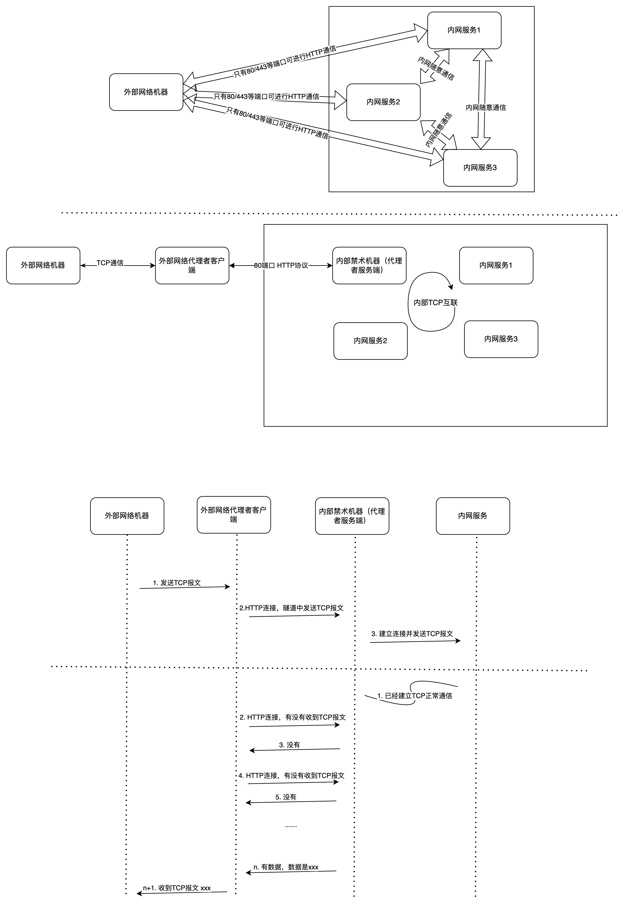

# java-tcp-proxy

**禁术！！！**

**慎用！！！ 慎用！！！ 慎用！！！**

基于HTTP协议构造TCP隧道




```shell
# 服务端， 服务端只需要一次部署
# server.port 是服务端开启的HTTP协议端口
java -jar java-tcp-proxy-0.0.1-SNAPSHOT.jar --server.port=8081 -server=true


# 客户端
# proxyHost proxyPort proxy服务端的域名IP / 端口
# targetHost targetPort 目标内网服务的域名IP / 端口
# bind 客户端开放的TCP端口
java -jar java-tcp-proxy-0.0.1-SNAPSHOT.jar \
    -server=false \
    -proxyHost=xxx -proxyPort=8081 \ 
    -targetHost=xxx -targetPort=xxx \
    -bind=xxx
```